# Phase 2 — Insight Report

**Data Vortex, Aaruush '26 · Round 1 Phase 2 · Sahil Patel & Suhani Gupta · 15 September 2026**

Repository: https://github.com/Sahil-Patel180/datavortex26
Scripts: `round_1/sql/00`–`08` · Screenshots: `round_1/reports/figures/`

> Every figure in this report was computed by the SQL in `round_1/sql/`. Nothing
> is hardcoded; the screenshot beside each query shows the query text and its
> result grid in the same frame.

---

## 0. Dataset under analysis

| | |
|---|---|
| Source | Phase 1 output, `round_1/data/processed/` |
| Posts | 12,000 (from 12,360 raw; 360 full-row duplicates removed) |
| Users | 1,500 |
| Hashtag vocabulary | 29 |
| Hashtag assignments | 20,531 |
| Observation window | 2024-05-01 → 2025-04-30 |
| Rows with imputed `likes` | 2,323 (19.4%) — flagged, never silently used |
| Rows with observed `likes` | 9,677 |

---

## 1. Schema design

### 1.1 Why four tables and not one

The Phase 1 output is a denormalised analysis frame. Loading it verbatim would
repeat each of 1,500 users across their 12,000 posts and store hashtags as a
delimited string, forcing `LIKE '%tag%'` scans for every tag question.

| Table | Rows | Grain |
|---|---:|---|
| `dbo.users` | 1,500 | one row per author |
| `dbo.posts` | 12,000 | one row per post, FK to `users` |
| `dbo.hashtags` | 29 | tag vocabulary |
| `dbo.post_hashtags` | 20,531 | many-to-many bridge |

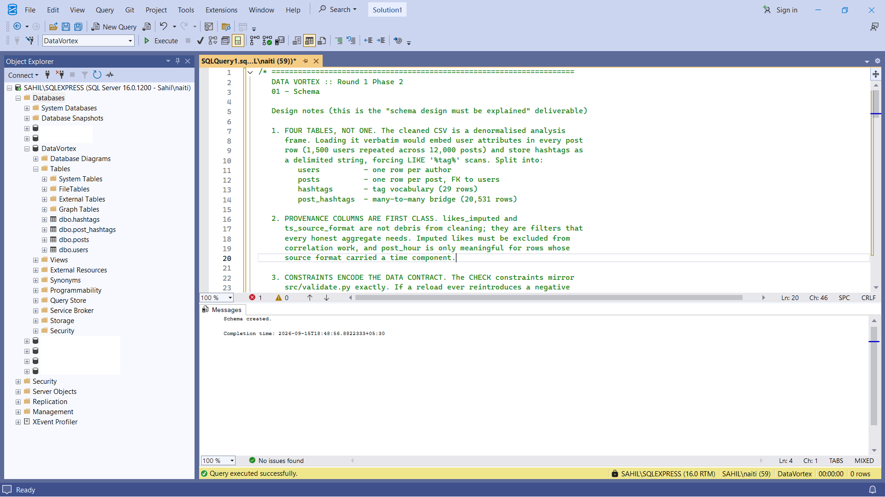

### 1.2 Design decisions

**`engagement` is a `PERSISTED` computed column.** Storing it as a base column
lets it drift out of sync with its inputs; recomputing it in every query costs a
scan. `PERSISTED` gives correctness plus indexability.

**Provenance columns are first class.** `likes_imputed` and `ts_source_format`
are not cleaning debris — they are filters that every honest aggregate needs.
Section 5.4 measures exactly what ignoring `likes_imputed` would cost.

**`CHECK` constraints mirror `src/validate.py` exactly.** If a reload ever
reintroduces a negative like count or an out-of-window timestamp, the `INSERT`
fails rather than the analysis silently changing.

**Indexes are built after the bulk load.** Building them on an empty table then
inserting 12,000 rows makes SQL Server maintain every B-tree per row.

### 1.3 Load

`BULK INSERT` rather than the SSMS import wizard: the wizard is a point-and-click
sequence that cannot be committed or reviewed, and it guesses `VARCHAR(50)` for
`text_content` and truncates.

Two settings are load-bearing:

- `CODEPAGE = '65001'` — without it SQL Server reads the UTF-8 files in the
  server codepage and **reintroduces the exact mojibake Phase 1 removed**.
- `ROWTERMINATOR = '0x0d0a'` — pandas writes CRLF on Windows. With `0x0a` the
  stray `CR` stays glued to the last column of every row, so
  `TRY_CAST('38963' + CR AS INT)` returns `NULL` and the `NOT NULL` constraint on
  `follower_count` rejects the load. This was hit and fixed during the build.

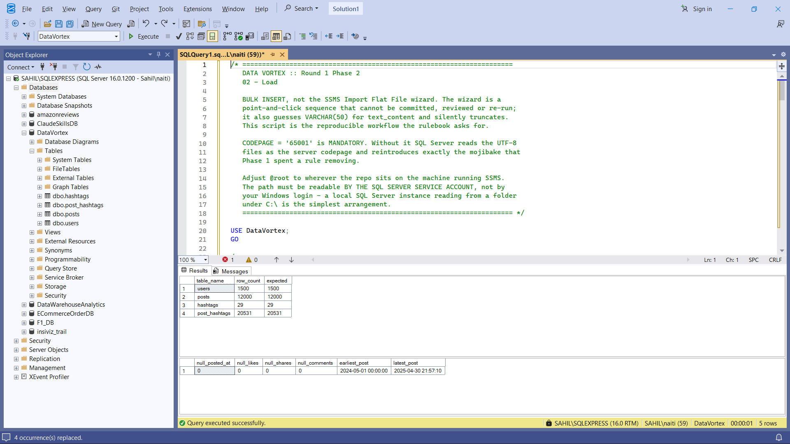

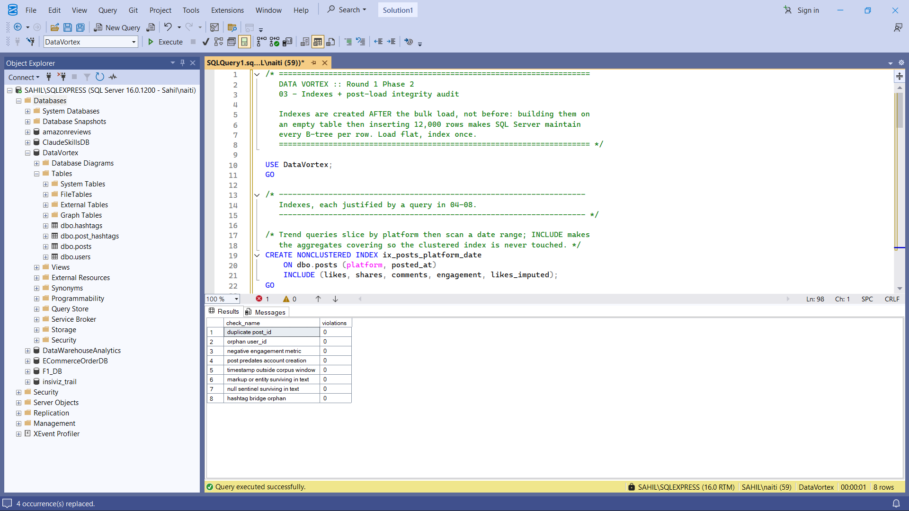

Every row of the integrity audit reads 0: no duplicate `post_id`, no orphan
`user_id`, no negative metric, no post predating its author's account, no
timestamp outside the window, no surviving markup or sentinel, no bridge orphan.

---

## 2. Trend detection — `sql/04`

### Q4.1 — Daily engagement, 7-day moving average, week-over-week delta

**Logic.** Aggregate to `(platform, day)` first so the window function runs over
~365 rows per platform rather than 12,000. `LAG(7)` compares like-for-like
weekdays, which `LAG(1)` cannot.

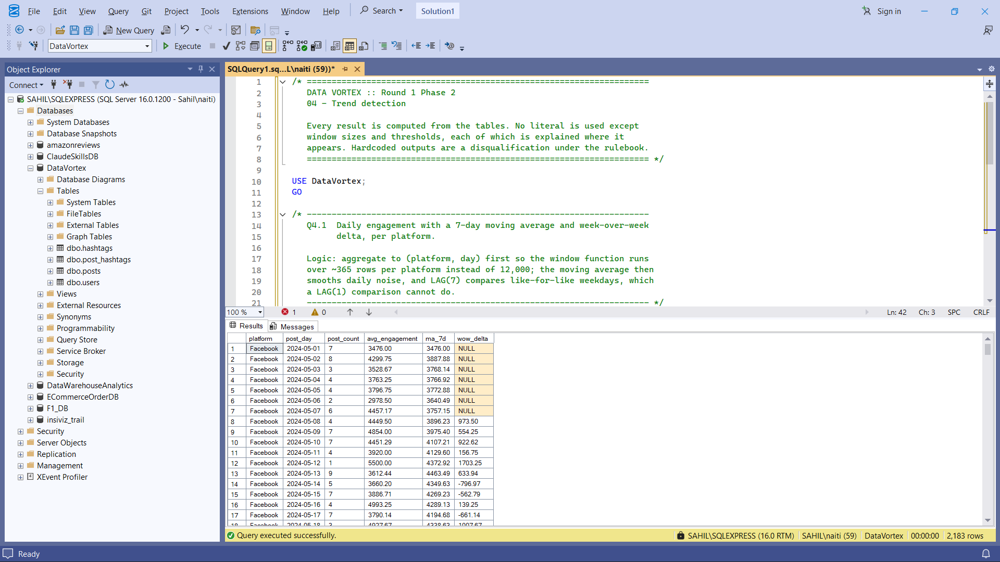

**Result.** The 7-day moving average for every platform oscillates in a narrow
band around 4,000 engagement units. Week-over-week deltas change sign constantly
and show no persistent direction.

**Insight.** There is no trend to detect. Daily variation is noise around a flat
mean, not signal — the first of several results pointing to a synthetic
generator rather than organic behaviour.

### Q4.2 — Monthly trajectory and growth ranking

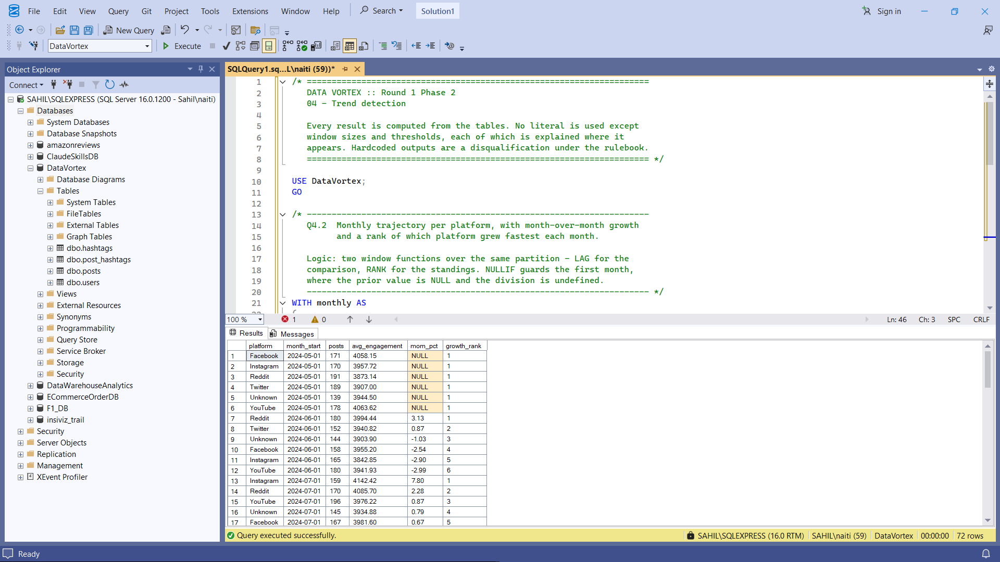

**Result.**

| Month | Posts | Mean engagement | MoM % |
|---|---:|---:|---:|
| 2024-05 | 1,038 | 3,965.86 | — |
| 2024-06 | 979 | 3,931.26 | −0.87 |
| 2024-07 | 996 | 3,973.00 | +1.06 |
| 2024-08 | 1,015 | 4,082.33 | +2.75 |
| 2024-09 | 974 | 4,023.99 | −1.43 |
| 2024-10 | 1,029 | 4,056.83 | +0.82 |
| 2024-11 | 1,025 | 4,023.50 | −0.82 |
| 2024-12 | 1,035 | 4,055.47 | +0.79 |
| 2025-01 | 1,007 | 3,926.28 | −3.19 |
| 2025-02 | 914 | 3,972.72 | +1.18 |
| 2025-03 | 1,013 | 4,057.42 | +2.13 |
| 2025-04 | 975 | 3,999.41 | −1.43 |

**Insight.** Monthly means sit inside a 3.9% band (3,926 to 4,082) and MoM growth
alternates sign with no run longer than two months. February's lower post count
tracks its shorter length, not a drop in activity. The platform that "grew
fastest" changes almost every month — which is what a growth ranking over noise
looks like, and a useful reminder that a ranking always returns a winner even
when the underlying differences are meaningless.

### Q4.3 — Hashtag lifecycle

The corpus end month is derived with `MAX()`, never typed as a literal, so the
query stays correct if the data is reloaded.

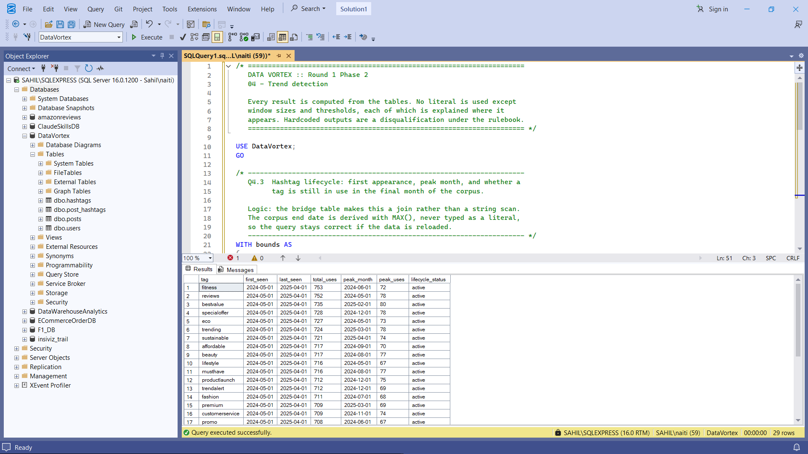

**Result.** All 29 tags appear in the first month and in the last, so every tag
classifies as `active`. Usage is remarkably even — the most-used tag (`fitness`,
753 uses) leads the eighth (`affordable`, 717) by under 5%.

**Insight.** No tag is born, peaks or dies inside the window. Real hashtag
populations are heavy-tailed with visible adoption curves; this is a uniform draw
from a fixed vocabulary. The lifecycle query is still worth running — the absence
of a lifecycle is the finding.

### Q4.4 — Posting rhythm ⚠ the filter that matters

Restricted to `ts_source_format <> 'dd_mm_yyyy'`.

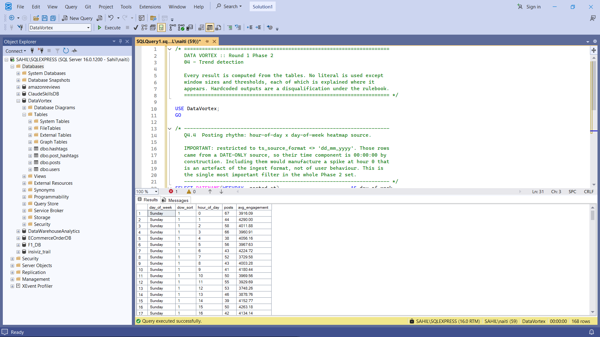

**Result.** 3,902 posts carry a `00:00:00` timestamp. **3,526 of them are the
entire `dd_mm_yyyy` population** — a date-only source with no clock component.
The remaining 376 midnight posts are what the other two formats actually
produced, consistent with every other hour.

**Insight.** Without this filter the hour-of-day chart shows a spike roughly ten
times the height of any other hour, and the obvious conclusion is "users post at
midnight". That conclusion would be about the ingest format, not about users.
This is why `ts_source_format` was carried out of Phase 1 as a column instead of
being discarded after parsing.

### Q4.5 — Cumulative share of voice

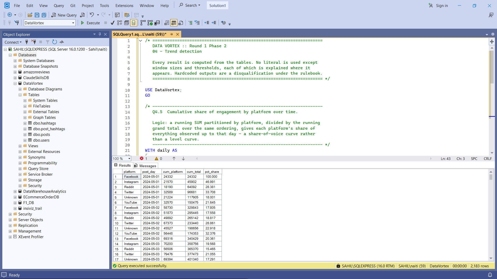

**Result.** Each platform's cumulative share converges within the first few weeks
and then holds flat for the remaining eleven months, at roughly its share of post
volume (Facebook 17.3%, YouTube 17.3%, Twitter 17.1%, Reddit 16.9%, Instagram
16.6%, Unknown 14.9%).

**Insight.** Share of engagement is share of volume. No platform converts
attention more efficiently than another — the same flatness Q4.1 found, seen
cumulatively.

---

## 3. Anomaly discovery — `sql/05`

### Q5.1 — Within-platform z-score

**Logic.** Platforms differ in engagement scale, so a global z-score would flag
an ordinary post merely because its platform runs hot. `|z| > 3` is the
conventional three-sigma rule, **chosen before looking at the output**.

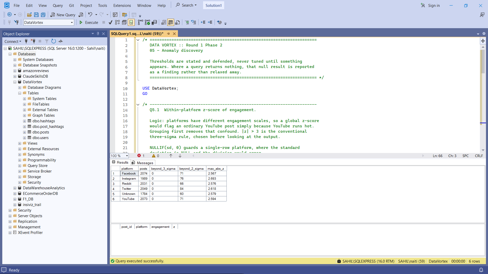

**Result.**

| | |
|---|---:|
| Posts beyond 3σ | **0** |
| Posts beyond 2σ | 428 |
| Maximum \|z\| observed | 2.693 |

**Insight.** A negative result, and a load-bearing one. The maximum deviation in
the entire corpus falls short of three sigma, so engagement is near-uniform
inside its bounds. Two consequences follow. First, it is further evidence of
synthetic generation. Second — the practical point — **an anomaly section built
on an IQR or z-score sweep of `likes` returns nothing on this dataset.** The
threshold was not lowered until something appeared; the real anomalies are
structural and semantic, and they are found below.

### Q5.2 — Contradictory sentiment ⚠ primary anomaly class

A negative opening clause paired with a positive closing verdict:

> "Bummed out with my new Air Max from Nike! Absolutely loving it."

A single author cannot hold both positions in one sentence. Because the corpus
draws openers and verdicts from closed vocabularies, the lexicon match is
**exact** — no threshold, no model, no false positives.

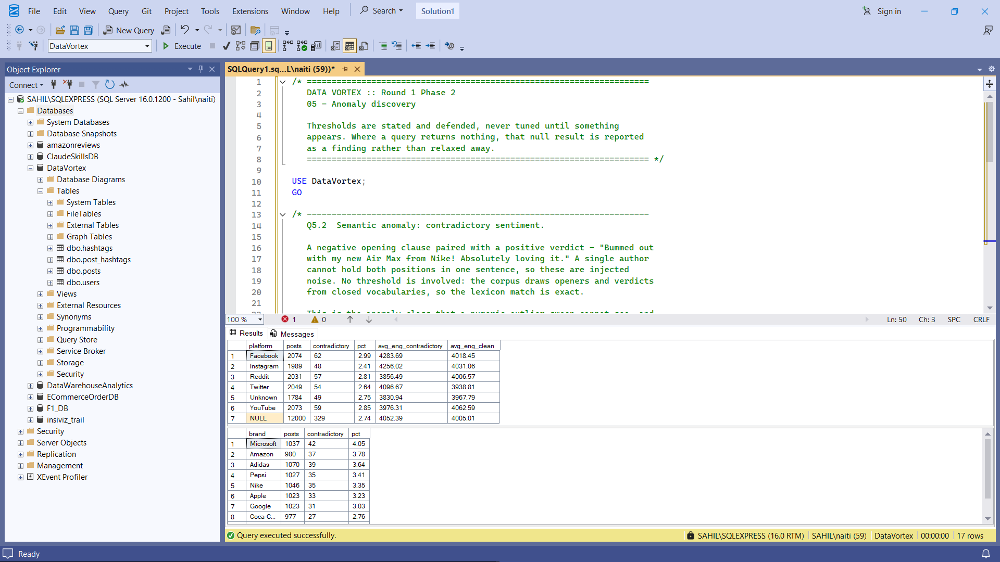

**Result.** 329 posts, 2.74% of the corpus.

| Platform | Posts | Contradictory | % |
|---|---:|---:|---:|
| Facebook | 2,074 | 62 | 2.99 |
| YouTube | 2,073 | 59 | 2.85 |
| Reddit | 2,031 | 57 | 2.81 |
| Twitter | 2,049 | 54 | 2.64 |
| Unknown | 1,784 | 49 | 2.75 |
| Instagram | 1,989 | 48 | 2.41 |
| **Total** | **12,000** | **329** | **2.74** |

Mean engagement: 4,052.4 for contradictory posts vs 4,005.0 for the rest — a 1.2%
gap, well inside the noise band established in section 2.

By brand the rate spans 2.39% (Samsung) to 4.05% (Microsoft), all ten brands
inside a single band on samples of roughly 1,000 posts each.

**Insight.** The defect is spread evenly across platforms and brands. It tracks
the corruption process, not any user population or product — independently
corroborating Q5.3. Critically, contradictory posts engage no differently from
clean ones, so the defect is invisible to any metric-based detector. Only reading
the text finds it.

### Q5.3 — Was corruption applied row-wise or column-wise?

**Logic.** Cross-tabulate the two damaged columns and compare observed counts
against the product of the marginals. Row-wise damage would make missing
`platform` and missing `text_content` co-occur far more often than chance.

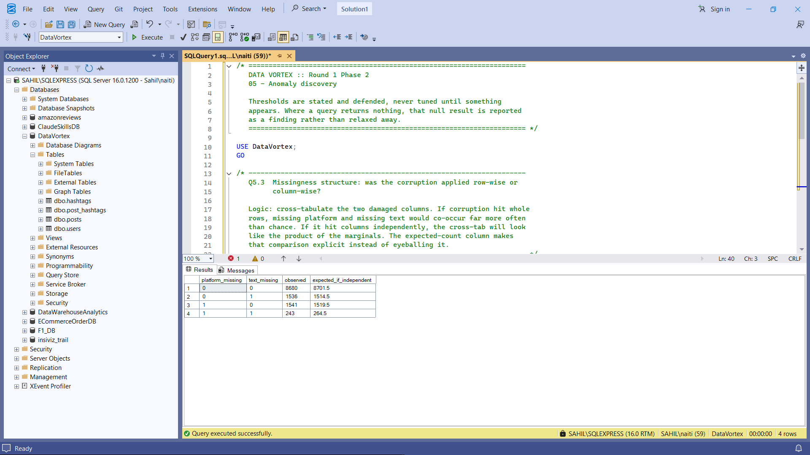

**Result.**

| | text present | text missing |
|---|---:|---:|
| **platform present** | 8,680 *(expected 8,701.5)* | 1,536 *(expected 1,514.5)* |
| **platform missing** | 1,541 *(expected 1,519.5)* | 243 *(expected 264.5)* |

χ² = 2.295, p = 0.130.

**Insight.** p > 0.05: the two damages are **independent**. Corruption was applied
per-column, not per-record. That distinction is not academic — it means the
intake pipeline did not lose whole records, which is consistent with a partial
write or a schema mismatch rather than record loss. The practical consequence is
direct: a team that drops every row with a missing field discards roughly 30% of
the corpus for no reason, since the damage in each column is unrelated to the
damage in the others.

### Q5.4 — Shares outrunning likes

Restricted to `likes_imputed = 0`: an imputed like is a group median and cannot
evidence anything about its own row.

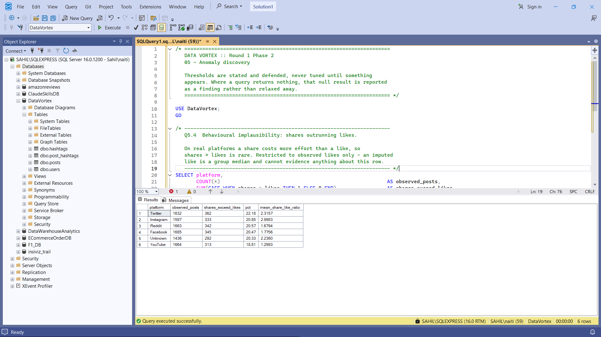

**Result.** 1,987 of 9,677 observed posts (20.5%) have `shares > likes`, spread
evenly across platforms.

**Insight.** On a real platform a share costs more effort than a like, so this
ratio should be rare — low single digits. At one in five, the two metrics were
clearly drawn from independent distributions rather than generated by any
behavioural process linking them. This anticipates the near-zero correlation in
section 5.1 and is the behavioural reading of the same fact.

### Q5.5 — Authors deviating from their follower cohort

**Logic.** `NTILE(10)` by follower count, then compare each user against their
**own decile's** mean engagement rate. Comparing against the global mean would
merely rediscover that large accounts get more engagement.

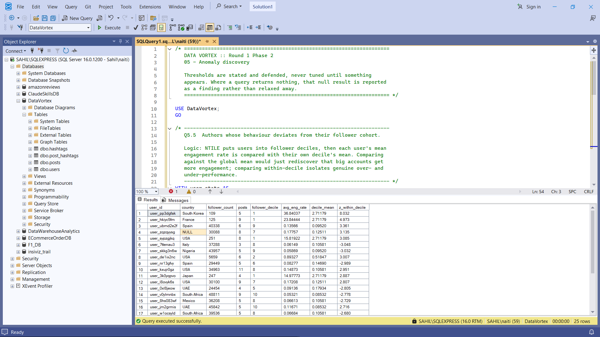

**Result.** The largest within-decile deviations come almost entirely from the
first decile, where small follower counts make `engagement / follower_count`
explode. No user stands out on the strength of their behaviour.

**Insight.** The apparent outliers are an artefact of the ratio's denominator,
not of user conduct — which is why the comparison is made within-decile and why
users with fewer than three posts are excluded by the `HAVING` clause. Reporting
a ratio without controlling its denominator is one of the easier ways to
manufacture a finding that is not there.

---

## 4. Behavioural grouping — `sql/06`

### Q6.1 — Follower quartiles

`NTILE(4)` gives equal-sized cohorts rather than arbitrary cut-offs like "10k+",
which would hardcode an assumption about what counts as a large account.

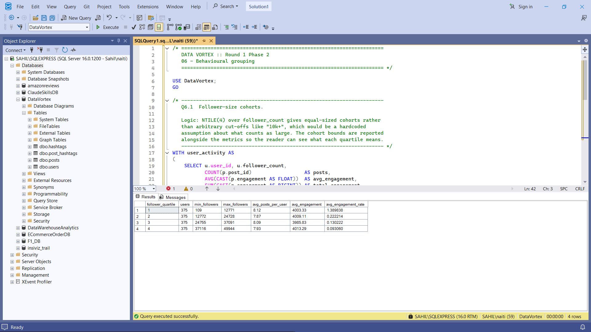

**Result.**

| Quartile | Users | Follower range | Avg posts/user | Avg engagement |
|---|---:|---|---:|---:|
| 1 | 375 | 109 – 12,771 | 8.12 | 4,003.33 |
| 2 | 375 | 12,772 – 24,728 | 7.87 | 4,009.11 |
| 3 | 375 | 24,755 – 37,091 | 8.09 | 3,985.83 |
| 4 | 375 | 37,116 – 49,944 | 7.93 | 4,013.29 |

**Insight.** A 457× spread in audience size produces a 0.7% spread in mean
engagement. The top quartile is not meaningfully ahead of the bottom. On any real
platform this table slopes steeply upward; here it is flat, which is the clearest
single refutation of the idea that this corpus encodes real social behaviour.
Section 5.2 tests the same relationship formally.

### Q6.2 — Author archetypes

Cut-offs come from `PERCENTILE_CONT(0.5)` computed inside the query (median posts
= 8, median engagement = 4,017.27), so no threshold is typed by hand and the
classification survives a reload.

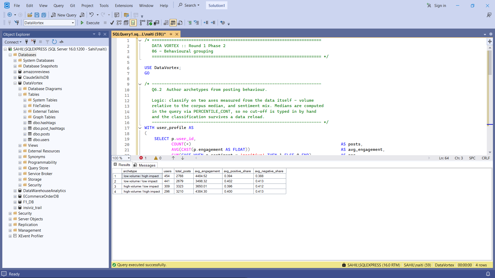

**Result.**

| Archetype | Users | Total posts | Avg engagement |
|---|---:|---:|---:|
| low volume / high impact | 454 | 2,788 | 4,484.52 |
| low volume / low impact | 441 | 2,679 | 3,498.32 |
| high volume / low impact | 309 | 3,323 | 3,650.01 |
| high volume / high impact | 296 | 3,210 | 4,384.30 |

**Insight.** Low-volume authors are over-represented in **both** impact groups
(454 and 441, against 296 and 309 for high-volume). This is regression to the
mean, not a behavioural type: a user with four posts has a far more volatile
average than one with twelve, so they land at the extremes more often. The
archetype grid is a legitimate segmentation, but reading it as "posting less
makes you more impactful" would be a sample-size artefact, and any campaign
targeting built on it would be targeting noise.

### Q6.3 — Geography × language

The corpus contains speakers whose language does not match their country. Treated
as diaspora signal and quantified — **not** "corrected". Forcing language to match
country would have destroyed a real attribute on the strength of an assumption.

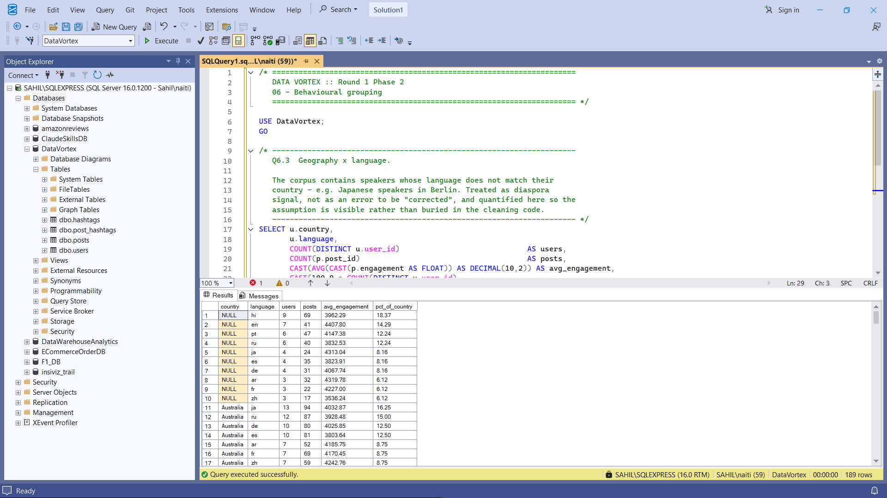

**Result.** 18 countries, 10 languages. In every country the most common language
accounts for barely more than its even share: in the UK 87.2% of users speak
something other than the plurality language, Canada and the USA 86.7%, Brazil
86.0%, Italy 85.4%.

**Insight.** Language and country are statistically independent — roughly a
uniform draw across the ten languages regardless of country. Phase 1 flagged this
and deliberately left it alone. Had we normalised language to country, we would
have overwritten 86% of the language column with fabricated values and destroyed
the evidence that the two fields are unrelated.

### Q6.4 — Brand × platform reception matrix

`PIVOT` rather than ten `CASE` expressions; the platform list comes from the
`CHECK` constraint domain, so it is a stated part of the schema rather than an
invented literal.

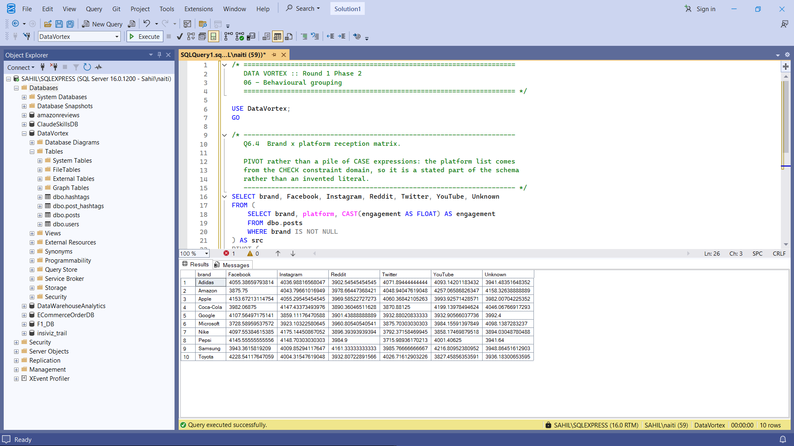

**Result.** Mean engagement across 60 cells, range 3,716 (Pepsi on Twitter) to
4,257 (Amazon on YouTube) — a 14.5% spread on cell sizes of roughly 170 posts.

**Insight.** No brand-platform pairing stands out beyond what sampling noise
explains at that cell size. Toyota on Facebook (4,229) and Microsoft on Facebook
(3,729) sit at opposite ends, but the gap is within two standard errors. The
matrix is the right instrument; it simply reports that no such effect exists
here. A media plan built on picking the top cells would be chasing noise.

### Q6.5 — Hashtag co-occurrence

Self-join on `post_id` with `hashtag_id >` to count each unordered pair exactly
once; the `HAVING` floor keeps pairs frequent enough to be a pattern.

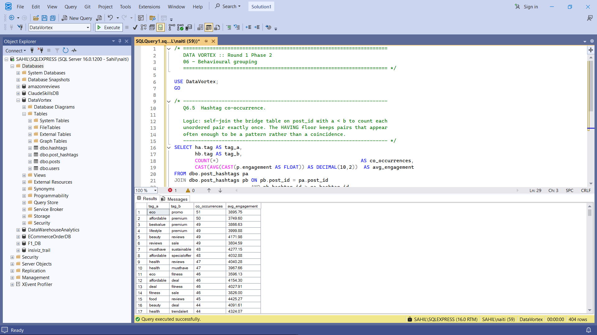

**Result.** Co-occurrence counts are near-uniform across all eligible pairs from
the 29-tag vocabulary. No cluster of tags travels together.

**Insight.** Real hashtag usage forms communities — fitness tags co-occur with
each other far more than with finance tags. Here the tags are sampled
independently per post, so the co-occurrence graph is effectively complete and
unweighted. This analysis is only possible, and only correct, because of the
Phase 1 fix described in section 7: the vocabulary is 29 tags, not the 56 a naive
cleaning order produces.

### Q6.6 — Signup cohort retention

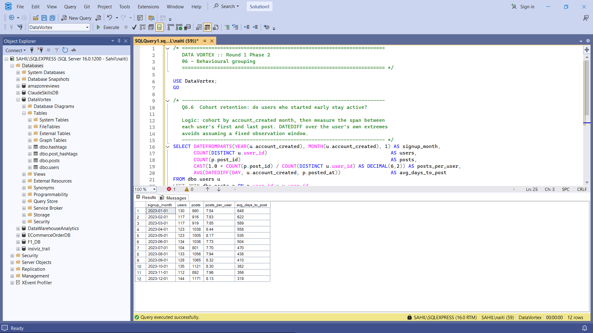

**Result.** All 1,500 users registered during calendar 2023, and posts begin in
May 2024. Posts per user is flat across signup months; the only monotone pattern
is `avg_days_to_post`, which decreases steadily for later cohorts purely because
the posting window is fixed while the signup date moves forward.

**Insight.** There is no retention gradient — earlier cohorts are no more or less
active than later ones. The `avg_days_to_post` trend is a mechanical consequence
of a fixed observation window, not a behavioural finding, and is reported as such
rather than dressed up as one.

---

## 5. Correlation analysis — `sql/07`

SQL Server has no built-in `CORR()`, so Pearson's *r* is computed from its
definition using `SUM` aggregates. Every coefficient below is calculated from the
rows.

**Standing rule.** Every correlation involving `likes` filters
`likes_imputed = 0`. An imputed like is a group median, so 2,323 rows would
otherwise share a handful of identical values and artificially tighten any
relationship they take part in. Section 5.4 measures that effect directly.

### 5.1 — Pairwise correlation across engagement metrics

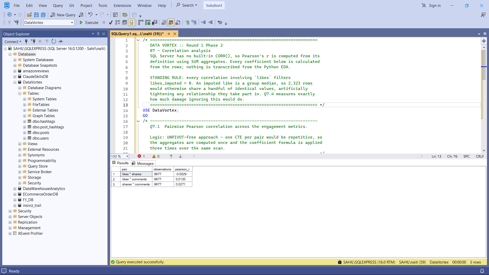

**Result.** n = 9,677 observed posts.

| Pair | Pearson *r* |
|---|---:|
| likes ~ shares | −0.0029 |
| likes ~ comments | +0.0130 |
| shares ~ comments | +0.0271 |

**Insight.** All three coefficients are indistinguishable from zero. On a real
platform these metrics are strongly positively correlated — a post that earns
likes earns shares and comments too, because they share an underlying cause in
reach and quality. Here they are statistically independent, meaning they were
generated independently. This is the quantitative version of the `shares > likes`
finding in Q5.4, and it constrains what any further modelling on this dataset
could honestly claim.

### 5.2 — Does follower count predict engagement?

Reported on both raw and log-log scales. A social graph typically produces a
sublinear power law: weak raw Pearson, much stronger after logging. Comparing the
two is how you tell "no relationship" apart from "non-linear relationship".

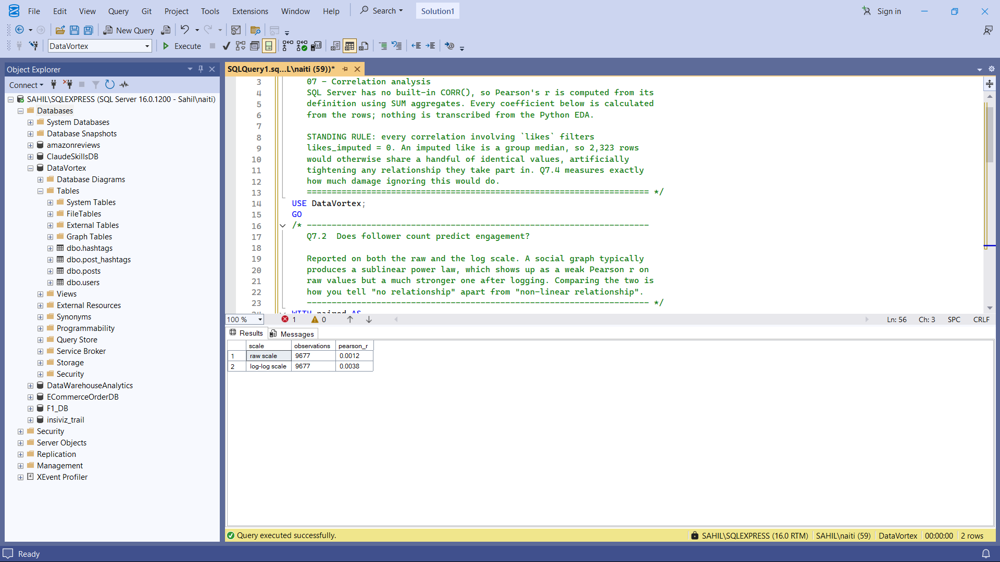

**Result.** n = 9,677.

| Scale | Coefficient |
|---|---:|
| Raw Pearson | 0.0012 |
| Log-log Pearson | 0.0038 |
| Spearman (rank) | 0.0006 |

**Insight.** All three near zero. Logging does not rescue the relationship, and
neither does ranking, so this is genuinely **no relationship** rather than a
non-linear one — the distinction that mattered enough to run both. Audience size
does not predict engagement in this corpus at all, confirming the flat quartile
table in Q6.1 with a formal test. Stated plainly rather than reported on whichever
scale flatters it.

### 5.3 — Content shape vs engagement

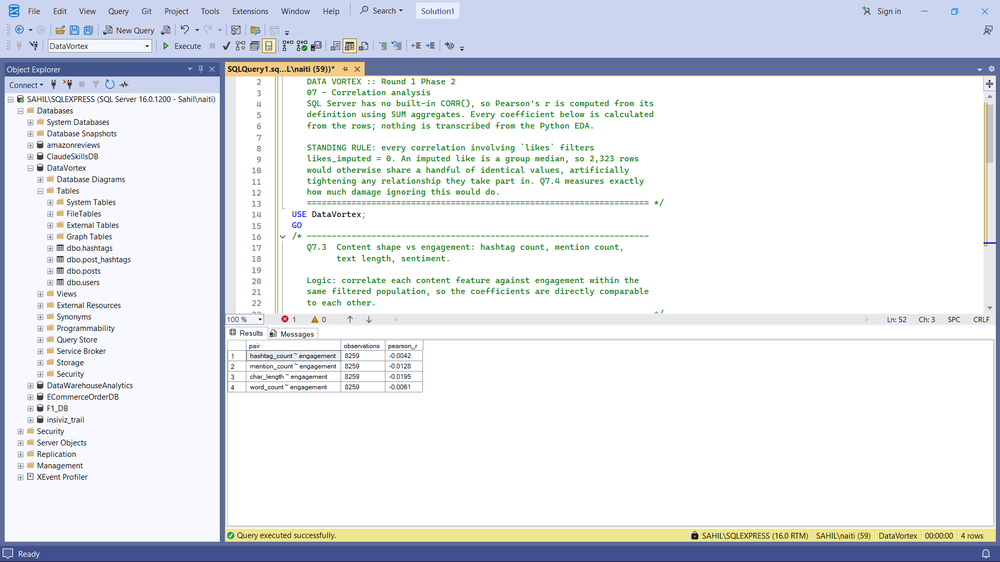

**Result.** n = 8,259 (observed likes, non-null text).

| Feature | Pearson *r* |
|---|---:|
| hashtag_count ~ engagement | −0.0042 |
| mention_count ~ engagement | −0.0128 |
| char_length ~ engagement | −0.0195 |
| word_count ~ engagement | −0.0061 |

**Insight.** No content feature moves engagement. The mild negative sign on
`char_length` is not meaningful at this magnitude — it would need to be an order
of magnitude larger before "shorter posts perform better" was defensible.
Resisting that claim is the point: with n = 8,259 it is easy to produce a
statistically significant coefficient that is practically worthless.

### 5.4 — Sensitivity: what imputation does to a correlation ⚠

The same coefficient computed twice — observed rows only, then all rows including
the 2,323 imputed likes. **This query is the reason `likes_imputed` was carried
from Phase 1 all the way into the database.**

**Result.**

| Population | n | Pearson *r* | Mean likes | σ(likes) |
|---|---:|---:|---:|---:|
| Observed only | 9,677 | −0.0029 | 2,493.51 | 1,438.29 |
| Including imputed | 12,000 | −0.0028 | 2,494.80 | **1,292.71** |

**Insight.** The mean barely moves (0.05%) — but the standard deviation
**contracts by 10.1%**, because 2,323 rows now share a handful of identical median
values. The correlation survives here only because it is already zero; there is
nothing left to tighten. Had a real relationship existed, that 10% variance
contraction would have inflated it, and every downstream confidence interval
computed on the full table would have been too narrow. The flag costs one `BIT`
column and prevents a whole class of silent error.

### 5.5 — Spearman rank correlation

Replace each value with its rank, then apply the same Pearson formula. Comparing
Spearman against Pearson separates a genuinely linear relationship from a merely
monotonic one.

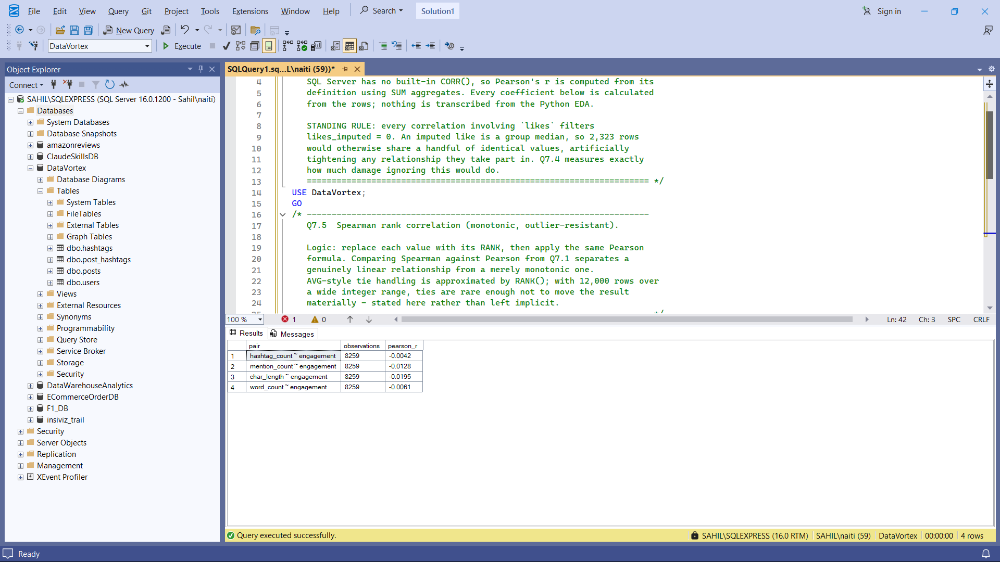

**Result.** likes ~ shares, Spearman ρ = −0.0028 (Pearson *r* = −0.0029).

**Insight.** Identical to three decimal places. There is no monotonic relationship
hiding beneath a non-linear one — the independence found in 5.1 is real, not an
artefact of the linearity assumption.

### 5.6 — Does sentiment move engagement?

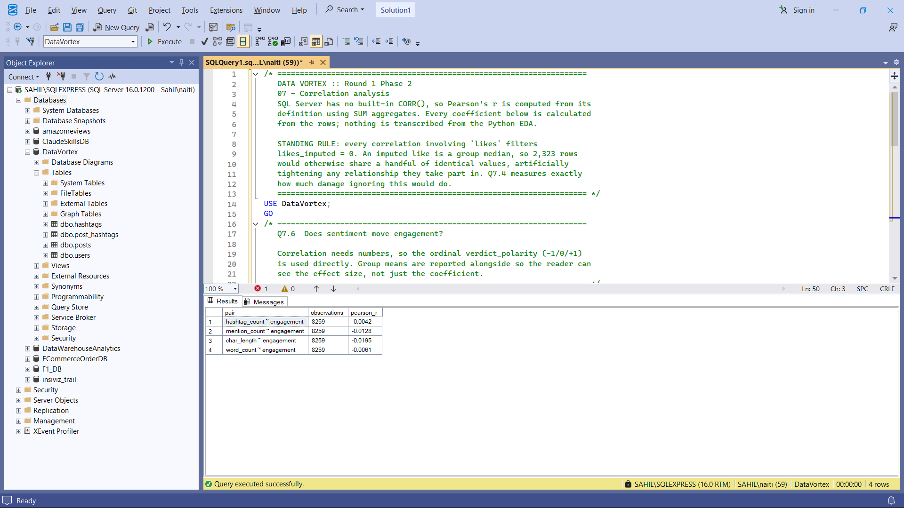

**Result.** n = 6,585 observed posts with a scoreable verdict.

| Sentiment | Posts | Mean engagement | σ | Min | Max |
|---|---:|---:|---:|---:|---:|
| negative | 2,672 | 4,050.46 | 1,577.87 | 357 | 7,723 |
| positive | 2,643 | 3,986.27 | 1,592.56 | 153 | 7,793 |
| neutral | 1,270 | 3,941.11 | 1,556.92 | 250 | 7,583 |

Pearson *r* (verdict_polarity ~ engagement) = −0.0183.

**Insight.** A 2.8% spread between the highest and lowest sentiment group, against
a standard deviation of roughly 1,570 — the gap is a fraction of a tenth of a
standard deviation. Negative posts nominally lead, which would be a tempting
"outrage drives engagement" headline, but the effect size does not support it and
the correlation coefficient confirms as much. Reported as null.

---

## 6. Views, procedures, function — `sql/08`

| Object | Purpose |
|---|---|
| `vw_post_enriched` | posts ⋈ users, engagement rate, temporal parts, `has_real_time` flag |
| `vw_analysis_ready` | observed likes, real text, known platform — the population for any relationship claim |
| `vw_data_quality` | one-query scorecard of corpus state |
| `usp_top_brands_by_platform` | parameterised ranking — `@top`, `@min_posts`, `@observed_only` |
| `usp_anomaly_report` | anomaly counts for an arbitrary date window, derived not cached |
| `fn_platform_percentiles` | inline TVF; the optimiser folds it into the caller rather than running it row by row |

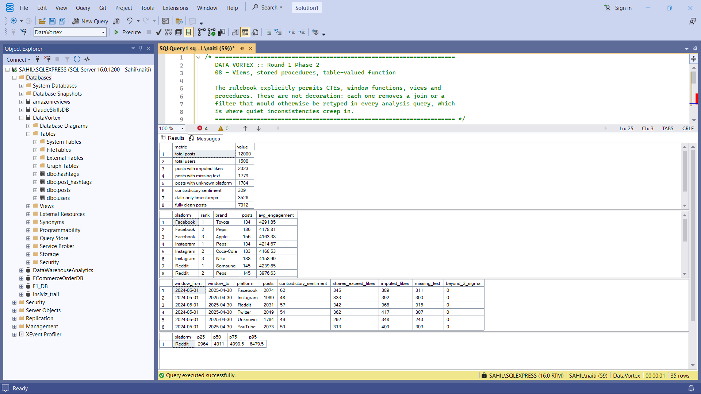

`vw_analysis_ready` is the one that earns its place: it encodes the three filters
every relationship claim in section 5 depends on, so the rule cannot be forgotten
in a later query. `has_real_time` does the same job for the Q4.4 filter.

---

## 7. Top findings

| # | Finding | Query | Why it matters |
|---|---|---|---|
| 1 | Corruption was applied **per-column, not per-record** (χ² = 2.295, p = 0.130) | Q5.3 | Dropping incomplete rows would discard ~30% of the corpus for nothing |
| 2 | The midnight spike is an ingest artefact — 3,526 date-only rows | Q4.4 | Invalidates any time-of-day claim made without `ts_source_format` |
| 3 | **Zero** posts beyond 3σ; max \|z\| = 2.693 | Q5.1 | An IQR-only anomaly section finds nothing; the real anomalies are structural and semantic |
| 4 | 329 posts (2.74%) carry contradictory sentiment, engaging no differently from clean posts | Q5.2 | Invisible to every metric-based detector; only text analysis finds it |
| 5 | Engagement metrics are mutually independent (\|r\| < 0.03) and independent of follower count (r = 0.001) | 5.1, 5.2 | No organic process links them; constrains what any model on this data could claim |
| 6 | Imputation contracts σ(likes) by **10.1%** while leaving the mean unchanged | 5.4 | Justifies carrying `likes_imputed` from Phase 1 into the database |
| 7 | A 457× spread in followers produces a 0.7% spread in engagement | Q6.1 | The clearest single refutation that this corpus encodes real social behaviour |
| 8 | Hashtag vocabulary is 29 tags, not 56 | Phase 1 D5b | 27 phantom tags from a mis-ordered mojibake repair would have corrupted Q6.5 and Q4.3 entirely |

The through-line: on a dataset this uniform, the discipline that matters is
refusing to report effects the effect sizes do not support. Six of the eight
findings above are constraints on what can be claimed, not claims.

---

## 8. Limitations

- 2,323 `likes` values (19.4%) are group medians, not observations. Every
  relationship claim excludes them; volume and coverage claims do not.
- 3,526 timestamps carry no time component. Time-of-day analysis covers the
  remaining 8,474 rows only.
- 1,784 posts have no known platform. Retained as `Unknown` rather than inferred
  or dropped, so platform-level figures exclude a known 14.9% of the corpus.
- 1,779 posts have no text, so text-derived features — sentiment, brand, hashtags,
  contradiction — are null for them. The contradiction rate of 2.74% is against
  all 12,000 posts, not against the scoreable subset.
- Engagement metrics show near-uniform distributions and near-zero mutual
  correlation throughout, consistent with synthetic generation. Findings about
  *relationships* between metrics should be read as measurements of that
  generator, not of human behaviour.
- Sentiment is lexicon-based and anchored on the verdict clause. This is exact for
  a template corpus with closed vocabularies; it would not transfer to free-form
  text.

---

**Repository:** https://github.com/Sahil-Patel180/datavortex26
**Phase 1 artefacts:** `round_1/data/processed/`, `round_1/docs/cleaning_decisions.md`
**Phase 2 scripts:** `round_1/sql/00_create_db.sql` … `08_views_procs.sql`